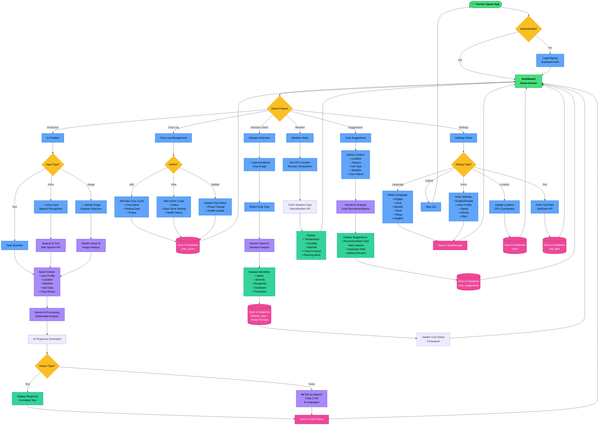

# FasalSetu - Architecture & Flow Diagrams

## Complete System Architecture

```mermaid
graph TB
    User([👨‍🌾 Farmer User])
    
    subgraph Frontend["🖥️ Frontend Layer - React + TypeScript"]
        Dashboard[Dashboard<br/>Home Screen]
        Chatbot[AI Chatbot<br/>Voice + Text + Image]
        CropLog[Crop Log<br/>Cycle Management]
        Disease[Disease Detection<br/>Image Analysis]
        Weather[Weather Alerts<br/>Real-time Updates]
        Suggestions[Crop Suggestions<br/>AI Recommendations]
        Settings[Settings<br/>Language + Voice Config]
    end
    
    subgraph Services["⚙️ Service Layer"]
        Auth[Authentication<br/>Supabase Auth]
        CropAdvisory[Crop Advisory AI<br/>Gemini Integration]
        VoiceService[Voice Service<br/>TTS + STT]
        DiseaseDetection[Disease Detection<br/>Vision AI]
        WeatherService[Weather Service<br/>API Integration]
        SoilService[Soil Data Service<br/>SoilGrids API]
        LocationService[Geolocation<br/>Browser GPS]
    end
    
    subgraph AI["🤖 AI/ML Layer"]
        Gemini[Google Gemini AI<br/>Text + Vision + Multimodal]
        Chirp[Chirp 3 TTS<br/>8 Regional Voices]
        SpeechAPI[Web Speech API<br/>Voice Recognition]
    end
    
    subgraph External["🌐 External APIs"]
        WeatherAPI[OpenWeather API<br/>Real-time Weather]
        SoilAPI[SoilGrids API<br/>Soil Properties]
    end
    
    subgraph Data["💾 Data Layer - Supabase"]
        DB[(PostgreSQL Database)]
        Storage[(Image Storage<br/>Disease Photos)]
        Tables[Tables:<br/>• users<br/>• crop_cycles<br/>• disease_logs<br/>• soil_data<br/>• crop_suggestions]
    end
    
    User --> Dashboard
    Dashboard --> Chatbot & CropLog & Disease & Weather & Suggestions & Settings
    
    Chatbot --> CropAdvisory & VoiceService
    Disease --> DiseaseDetection
    CropLog --> Auth
    Weather --> WeatherService
    Suggestions --> CropAdvisory
    Settings --> VoiceService
    
    CropAdvisory --> Gemini
    DiseaseDetection --> Gemini
    VoiceService --> Chirp & SpeechAPI
    WeatherService --> WeatherAPI & LocationService
    SoilService --> SoilAPI & LocationService
    
    Auth --> DB
    CropAdvisory --> DB
    DiseaseDetection --> DB & Storage
    SoilService --> DB
    
    DB --> Tables
    
    classDef userStyle fill:#4ade80,stroke:#22c55e,stroke-width:4px,color:#000,font-weight:bold
    classDef frontendStyle fill:#60a5fa,stroke:#3b82f6,stroke-width:2px,color:#000
    classDef serviceStyle fill:#fbbf24,stroke:#f59e0b,stroke-width:2px,color:#000
    classDef aiStyle fill:#a78bfa,stroke:#8b5cf6,stroke-width:2px,color:#000
    classDef externalStyle fill:#fb923c,stroke:#f97316,stroke-width:2px,color:#000
    classDef dataStyle fill:#ec4899,stroke:#db2777,stroke-width:2px,color:#fff
    
    class User userStyle
    class Dashboard,Chatbot,CropLog,Disease,Weather,Suggestions,Settings frontendStyle
    class Auth,CropAdvisory,VoiceService,DiseaseDetection,WeatherService,SoilService,LocationService serviceStyle
    class Gemini,Chirp,SpeechAPI aiStyle
    class WeatherAPI,SoilAPI externalStyle
    class DB,Storage,Tables dataStyle
```



---

## Complete User Flow Diagram



---

## Component Structure

```
FasalSetu_New/
│
├── src/
│   ├── components/
│   │   ├── HomePage.tsx              # Main dashboard
│   │   ├── Chatbot.tsx               # AI chat interface
│   │   ├── CropLog.tsx               # Crop management
│   │   ├── DiseaseDetectionTest.tsx  # Disease detection
│   │   ├── CropSuggestions.tsx       # AI recommendations
│   │   ├── CalendarAlerts.tsx        # Weather alerts
│   │   ├── Settings.tsx              # App settings
│   │   ├── WelcomeHome.tsx           # Welcome screen
│   │   ├── LoginSignup.tsx           # Authentication
│   │   └── ui/                       # Reusable UI components
│   │       ├── sheet.tsx
│   │       └── [other UI components]
│   │
│   ├── services/
│   │   ├── cropAdvisoryAI.ts         # Gemini AI integration
│   │   ├── voiceService.ts           # Voice I/O
│   │   ├── diseaseDetectionService.ts # Disease detection
│   │   ├── weatherService.ts         # Weather API
│   │   ├── soilService.ts            # Soil data
│   │   ├── geolocationService.ts     # GPS services
│   │   └── smartAlertService.ts      # Alert system
│   │
│   ├── lib/
│   │   ├── supabase.ts               # Supabase client
│   │   ├── auth-helpers.ts           # Authentication
│   │   ├── crop-db.ts                # Crop database ops
│   │   ├── soil-db.ts                # Soil database ops
│   │   ├── crop-suggestions-db.ts    # Suggestions DB
│   │   ├── user-location.ts          # Location management
│   │   └── location-sync.ts          # Location sync
│   │
│   ├── styles/
│   │   └── globals.css               # Global styles
│   │
│   ├── App.tsx                       # Main app component
│   ├── main.tsx                      # Entry point
│   └── vite-env.d.ts                 # TypeScript definitions
│
├── public/                           # Static assets
├── *.sql                             # Database setup scripts
├── .env                              # Environment variables
├── package.json                      # Dependencies
├── vite.config.ts                    # Vite configuration
├── tsconfig.json                     # TypeScript config
└── tailwind.config.js                # Tailwind config
```

---

## Data Flow Diagrams

### 1. AI Chatbot Data Flow

```
User Input (Text/Voice/Image)
         ↓
   Input Processing
   • Text: Direct
   • Voice: Speech-to-Text
   • Image: Base64 encoding
         ↓
   Context Building
   ├─ User Profile (from users table)
   ├─ Location (GPS coordinates)
   ├─ Weather Data (OpenWeather API)
   ├─ Soil Properties (soil_data table)
   ├─ Crop History (crop_cycles table)
   └─ Disease History (disease_logs table)
         ↓
   Gemini AI Processing
   • Model: gemini-1.5-pro
   • Context: Full farmer context
   • Language: User's selected language
         ↓
   Response Generation
   • Formatted text
   • Actionable advice
   • Multi-language support
         ↓
   Output Processing
   ├─ Text Display (formatted)
   └─ Voice Output (TTS if requested)
         ↓
   Persistence
   └─ Save to localStorage (chat history)
```

### 2. Disease Detection Data Flow

```
Image Capture/Upload
         ↓
   Image Validation
   • Size check (< 5MB)
   • Format check (JPEG/PNG)
   • Quality check
         ↓
   Crop Selection
   • User selects crop type
   • Validates selection
         ↓
   Image Upload
   • Convert to base64
   • Upload to Supabase Storage
   • Get public URL
         ↓
   AI Analysis
   • Gemini Vision API
   • Crop-specific analysis
   • Disease identification
         ↓
   Result Processing
   ├─ Disease Name
   ├─ Severity Level
   ├─ Symptoms
   ├─ Treatment Options
   └─ Prevention Tips
         ↓
   Database Storage
   • Save to disease_logs
   • Link to crop_cycle
   • Store image URL
         ↓
   Crop Status Update
   • Update health_status
   • Trigger notifications
         ↓
   User Notification
   └─ Display results
```

### 3. Weather Alert Data Flow

```
User Location Request
         ↓
   GPS Acquisition
   • Browser Geolocation API
   • User permission check
   • Coordinate extraction
         ↓
   Location Storage
   • Save to users table
   • Update location fields
   • Cache in localStorage
         ↓
   Weather API Call
   • OpenWeather API
   • Current weather
   • 7-day forecast
         ↓
   Data Processing
   ├─ Temperature
   ├─ Humidity
   ├─ Rainfall
   ├─ Wind speed
   └─ Conditions
         ↓
   Alert Generation
   • Farming-specific alerts
   • Irrigation recommendations
   • Weather warnings
         ↓
   Display
   └─ Weather dashboard
```

### 4. Soil Data Flow

```
Location Available
         ↓
   SoilGrids API Call
   • Latitude/Longitude
   • Property selection
   • Depth specification
         ↓
   Data Retrieval
   ├─ Soil Type
   ├─ pH Level
   ├─ NPK Values
   ├─ Organic Carbon
   ├─ CEC
   ├─ Texture
   └─ Bulk Density
         ↓
   Data Processing
   • Unit conversion
   • Value normalization
   • Quality checks
         ↓
   Database Storage
   • Save to soil_data table
   • Link to user
   • Timestamp
         ↓
   Usage
   ├─ AI Context
   ├─ Crop Recommendations
   └─ Fertilizer Advice
```

---

## Database Entity Relationship Diagram

```
┌─────────────┐
│    users    │
├─────────────┤
│ id (PK)     │
│ email       │
│ location_*  │
│ created_at  │
└──────┬──────┘
       │
       │ 1:N
       │
       ├──────────────────┬──────────────────┬──────────────────┐
       │                  │                  │                  │
       ↓                  ↓                  ↓                  ↓
┌─────────────┐    ┌─────────────┐    ┌─────────────┐    ┌─────────────┐
│crop_cycles  │    │disease_logs │    │  soil_data  │    │crop_suggest │
├─────────────┤    ├─────────────┤    ├─────────────┤    ├─────────────┤
│crop_id (PK) │    │log_id (PK)  │    │soil_id (PK) │    │suggest_id   │
│user_id (FK) │    │user_id (FK) │    │user_id (FK) │    │user_id (FK) │
│crop_name    │    │crop_id (FK) │    │latitude     │    │crop_name    │
│sowing_date  │    │disease_name │    │longitude    │    │season       │
│phase        │    │severity     │    │soil_type    │    │reason       │
│health_status│    │image_url    │    │ph           │    │yield        │
│is_active    │    │remedy       │    │npk          │    │created_at   │
│created_at   │    │created_at   │    │created_at   │    └─────────────┘
└──────┬──────┘    └─────────────┘    └─────────────┘
       │
       │ 1:N
       │
       ↓
┌─────────────┐
│disease_logs │
│(linked)     │
└─────────────┘
```

---

## Technology Stack Diagram

```
┌─────────────────────────────────────────────────────────┐
│                    User Interface                        │
│              React 18 + TypeScript + Vite                │
│                   TailwindCSS + Lucide                   │
└────────────────────┬────────────────────────────────────┘
                     │
┌────────────────────┴────────────────────────────────────┐
│                  Service Layer                           │
│  ┌──────────┐  ┌──────────┐  ┌──────────┐  ┌─────────┐│
│  │Crop AI   │  │Voice Svc │  │Disease   │  │Weather  ││
│  │Service   │  │(TTS/STT) │  │Detection │  │Service  ││
│  └──────────┘  └──────────┘  └──────────┘  └─────────┘│
└────────────────────┬────────────────────────────────────┘
                     │
┌────────────────────┴────────────────────────────────────┐
│                   AI/ML Layer                            │
│  ┌──────────────┐  ┌──────────────┐  ┌──────────────┐ │
│  │Gemini AI     │  │Chirp 3 TTS   │  │Web Speech    │ │
│  │(Text+Vision) │  │(8 Voices)    │  │API (STT)     │ │
│  └──────────────┘  └──────────────┘  └──────────────┘ │
└────────────────────┬────────────────────────────────────┘
                     │
┌────────────────────┴────────────────────────────────────┐
│              External APIs & Services                    │
│  ┌──────────────┐  ┌──────────────┐  ┌──────────────┐ │
│  │OpenWeather   │  │SoilGrids     │  │Geolocation   │ │
│  │API           │  │API           │  │API           │ │
│  └──────────────┘  └──────────────┘  └──────────────┘ │
└────────────────────┬────────────────────────────────────┘
                     │
┌────────────────────┴────────────────────────────────────┐
│                  Data Layer                              │
│              Supabase (PostgreSQL)                       │
│  ┌──────────────┐  ┌──────────────┐  ┌──────────────┐ │
│  │Database      │  │Authentication│  │Storage       │ │
│  │(5 Tables)    │  │(JWT)         │  │(Images)      │ │
│  └──────────────┘  └──────────────┘  └──────────────┘ │
└─────────────────────────────────────────────────────────┘
```

---

## Deployment Architecture

```
┌─────────────────────────────────────────────────────────┐
│                    User Devices                          │
│         Desktop | Mobile | Tablet                        │
│         Chrome | Edge | Safari                           │
└────────────────────┬────────────────────────────────────┘
                     │ HTTPS
                     ↓
┌─────────────────────────────────────────────────────────┐
│                  CDN / Hosting                           │
│              Vercel / Netlify                            │
│         (Static Assets + React App)                      │
└────────────────────┬────────────────────────────────────┘
                     │
        ┌────────────┴────────────┐
        │                         │
        ↓                         ↓
┌──────────────┐          ┌──────────────┐
│  Supabase    │          │ External APIs│
│  Backend     │          │              │
├──────────────┤          ├──────────────┤
│• PostgreSQL  │          │• Gemini AI   │
│• Auth        │          │• OpenWeather │
│• Storage     │          │• SoilGrids   │
│• RLS         │          │• Speech API  │
└──────────────┘          └──────────────┘
```

---

## Security Architecture

```
┌─────────────────────────────────────────────────────────┐
│                  Security Layers                         │
└─────────────────────────────────────────────────────────┘

Layer 1: Authentication
├─ Supabase Auth (JWT)
├─ Email/Password
├─ Session Management
└─ Token Refresh

Layer 2: Authorization
├─ Row Level Security (RLS)
├─ User Data Isolation
├─ Policy-based Access
└─ Role-based Permissions

Layer 3: Data Protection
├─ HTTPS Encryption
├─ API Key Protection
├─ Environment Variables
└─ Secure Storage

Layer 4: Privacy
├─ Location Consent
├─ Data Ownership
├─ GDPR Compliance
└─ User Data Control
```

---

**Last Updated**: November 23, 2025  
**Version**: 1.0  
**Project**: FasalSetu - AI-Powered Farming Assistant
